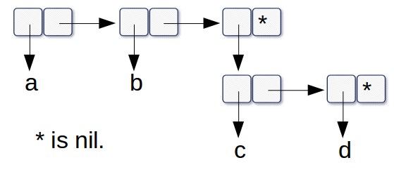

1.



2.
```lisp
(defun new-union (lst1 lst2)
    (let ((tmplst '()))
	    (dolist (obj lst2)
		    (if (not (member obj lst1))
			    (setf tmplst (append tmplst (cons obj '())))
			    nil))
		(append lst1 tmplst)))
```
3.
```lisp
(defun occurrences (lst)
    (let ((tmplst '()))
	    (dolist (obj lst)
		    (if (assoc obj tmplst)
			    (setf tmplst (addcount obj tmplst))
			    (setf tmplst (append tmplst (cons (cons obj 1) nil)))))
	    (sort tmplst #'(lambda (lst1 lst2) (> (cdr lst1) (cdr lst2))))))

(defun addcount (obj tmplst)
    (let (reslst '())
	    (dolist (xobj tmplst)
			    (if (equal (car xobj) obj)
				    (setf reslst (append reslst (cons (cons obj (+ (cdr xobj) 1)) nil)))
				    (setf reslst (append reslst (cons xobj '())))))
	    reslst))
```

4.
```
Because () is not atom type, so the '(a) is not the same with (a) in '((a) (b))
But you can use keyword argument :test #'equal to modify it
```

5.
```lisp
; iteration
(defun pos+1 (lst)
	(let ((tmplst nil) (n 0))
		(dolist (obj lst)
		    (setf tmplst (append tmplst (cons (+ obj n) nil)))
			(setf n (+ n 1)))
	    tmplst))

    ; recursion
(defun pos+2 (lst)
    (wtf lst 0))

(defun wtf (lst n)
	(if (null lst)
	    nil
	    (cons (+ (car lst) n) (wtf (cdr lst) (+ n 1)))))

    ; mapcar (In fact, I also use iteration to create a list from 0 to n-1...)
(defun pos+3 (lst)
    (mapcar #'+ lst
	    (let ((tmplst nil) (n 0))
		    (dolist (obj lst)
			    (setf tmplst (append tmplst (cons n nil)))
			    (setf n (+ n 1)))
			tmplst)))
```


6.
```lisp
(defun cdr-x (lst)
	(car lst))

(defun car-x (lst)
	(cdr lst))

(defun cons-new (obj lst)
	())

(defun length-new (lst)
	(if (null lst)
		0
		(+ 1 (length-new (car-x lst)))))

(defun member-new (obj lst)
	(if (null lst)
		nil
		(if (eql obj (cdr-x lst))
			lst
			(member-new obj (car-x lst)))))
```

7.
```lisp
; modified version
(defun compress-m (x)
	(if (consp x)
		(compr-m (car x) 1 (cdr x))
		x))

(defun compr-m (elt n lst)
	(if (null lst)
		(list (n-elts-m elt n))
		(let ((next (car lst)))
			(if (eql next elt)
				(compr-m elt (+ n 1) (cdr lst))
				(cons (n-elts-m elt n)
						(compr-m next 1 (cdr lst)))))))

(defun n-elts-m (elt n)
	(if (> n 1)
		(cons n elt) ; modify here
		elt))
```
8.
```lisp
(defun showdots (lst)
	(let ((n (length lst)))
		(dolist (obj lst)
			(format t "(~A . " obj))
		(format t "NIL")
		(do ((i 1 (+ i 1)))
			((> i n) 'nil)
			(format t ")"))))
```
9.
```lisp
; copied from the book and modified
    (defun shortest-path (start end net)
	    (bfs end (list (list start)) net))

    (defun bfs (end queue net)
	    (if (null queue)
		    nil
		    (let ((path (car queue)))
			    (let ((node (car path)))
				    (if (and (eql node end) (null (cdr queue)))
					    (reverse path)
					    (bfs end
						    (append (cdr queue) 
								    (new-paths path node end net))
								    net))))))

    (defun new-paths (path node end net)
	    (if (equal node end)
		    nil
		    (let ((tmplst (mapcar #'(lambda (n) (cons n path)) (cdr (assoc node net))))
			      (reslst nil))
			    (dolist (obj tmplst)
				    (if (> (no-repeat obj) (length obj)) 
					    (setf reslst (cons obj reslst))
					    nil))
			    reslst)))

    (defun no-repeat (lst)
	    (let ((tmplst nil))
		    (do ((i 1 (+ i 1)))
			    ((or (member (nth (- i 1) lst) tmplst) (> i (length lst))) i)
			    (setf tmplst (cons (nth (- i 1) lst) tmplst)))))
```
